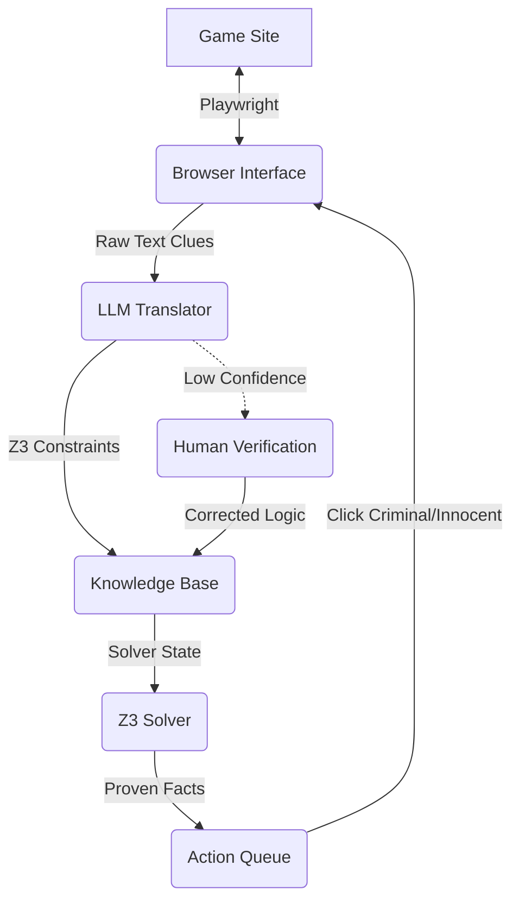

# Clues by Sam Solver - Workflow Design

## 1. Architecture Overview

The system operates on a **Observe -> Parse -> Deduce -> Act** loop.

## 2. Component Flows

### Task A: Browser Interface (Playwright)
**Goal**: Interact with the game grid, extract state, and execute moves.

1.  **Initialization**:
    *   Launch Headless Browser.
    *   Navigate to `https://cluesbysam.com`.
    *   Handle welcome modals.
2.  **State Extraction**:
    *   **Grid Parsing**: Scrape all 20 cells.
        *   `id`: (e.g., A1, B2)
        *   `name`: (e.g., Anna)
        *   `profession`: (e.g., Painter)
        *   `status`: `UNKNOWN` | `INNOCENT` | `CRIMINAL`
    *   **Clue Extraction**:
        *   Detect currently visible clues.
        *   Maintain a history of seen clues to avoid reprocessing.
3.  **Action Execution**:
    *   Receive command: `mark_innocent(cell_id)` or `mark_criminal(cell_id)`.
    *   Locate element by `cell_id`.
    *   Click and select the appropriate status.
    *   Wait for animation/update.

### Task B: Translator (LLM + Pydantic-AI)
**Goal**: Convert natural language clues into First-Order Logic (Z3 constraints).

1.  **Schema Definition**:
    *   Define Pydantic models for the game entities (Person, Position, Profession).
    *   Define available Z3 predicates (e.g., `is_neighbor(p1, p2)`, `count_criminals(list)`).
2.  **Translation Process**:
    *   **Input**: Natural language clue string.
    *   **Prompt**: System prompt with Z3 API examples and game rules.
    *   **Output**: Structured object representing the Z3 constraint.
3.  **Validation & Human-in-the-loop**:
    *   Attempt to compile/parse the generated constraint.
    *   If parsing fails or LLM indicates low confidence -> **Pause and ask User**.
    *   If valid -> Add to Knowledge Base.

### Task C: Solver (Z3)
**Goal**: Deterministically find the status of unknown cells.

1.  **Knowledge Base (KB)**:
    *   **Static Rules**:
        *   Grid topology (who is neighbor to whom).
        *   Game rules (e.g., "Neighbors include diagonals").
    *   **Dynamic Rules**:
        *   Accumulated constraints from clues.
        *   Current known state (e.g., "Anna is definitely Innocent").
2.  **Solving Strategy**:
    *   Create 20 Boolean variables: `x_A1, x_A2, ...` (True = Criminal, False = Innocent).
    *   Add all KB constraints to the solver.
    *   **Deduction Loop** (for each UNKNOWN cell $C$):
        *   **Check Innocent**: Add constraint `C == Criminal`. Check `solver.check()`.
            *   If `UNSAT` -> $C$ **MUST** be Innocent.
        *   **Check Criminal**: Add constraint `C == Innocent`. Check `solver.check()`.
            *   If `UNSAT` -> $C$ **MUST** be Criminal.
3.  **Output**: List of proven facts to be executed by the Browser Interface.

