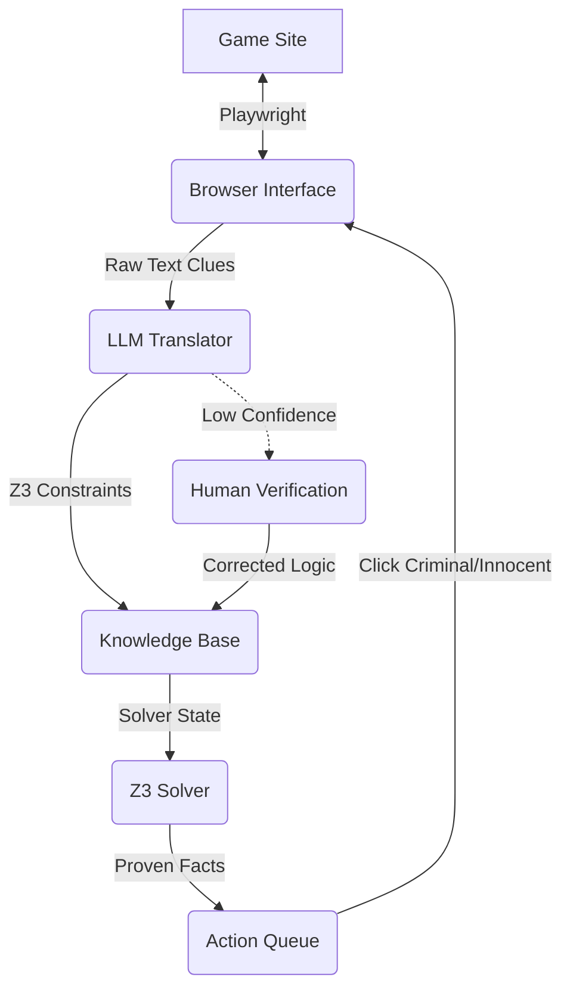

# Clues by Sam Solver - Workflow Design

## 1. Architecture Overview

The system operates on a **Observe -> Parse -> Deduce -> Act** loop, implemented in Python using `asyncio`.

**Key Technologies:**
*   **Browser Automation**: `playwright`
*   **LLM / Translation**: `pydantic-ai` (using OpenAI GPT-4o)
*   **Logic Solver**: `z3-solver`
*   **Dependency Management**: `poetry`



## 2. Project Structure

```
src/
├── browser/
│   └── scraper.py       # Playwright interaction (GameScraper)
├── models/
│   └── game_state.py    # Pydantic models (Person, Status)
├── solver/
│   ├── engine.py        # Main solving logic (GameSolver)
│   └── knowledge_base.py # Z3 wrapper and predicates (KnowledgeBase)
└── translator/
    └── translator.py    # LLM agent (ClueTranslator)
main.py                  # Main application loop
```

## 3. Component Flows

### Task A: Browser Interface (Playwright)
**Goal**: Interact with the game grid, extract state, and execute moves.

1.  **Initialization**:
    *   Launch Headless Browser (configurable).
    *   Navigate to `https://cluesbysam.com`.
    *   Handle welcome modals.
2.  **State Extraction** (`get_grid_state`):
    *   **Grid Parsing**: Scrape all 20 cells.
        *   `id`: (e.g., A1, B2)
        *   `name`: (e.g., Anna)
        *   `profession`: (e.g., Painter)
        *   `status`: `UNKNOWN` | `INNOCENT` | `CRIMINAL`
    *   **Clue Extraction**:
        *   Detect currently visible clues on card backs.
        *   Maintain a history of seen clues to avoid reprocessing.
3.  **Action Execution** (`mark_person`):
    *   Receive command: `mark_innocent(name)` or `mark_criminal(name)`.
    *   Locate element by name.
    *   Click and select the appropriate status in the modal.
    *   Wait for animation/update.

### Task B: Translator (LLM + Pydantic-AI)
**Goal**: Convert natural language clues into First-Order Logic (Z3 constraints).

1.  **Agent Setup**:
    *   Uses `pydantic-ai` Agent with `gpt-4o`.
    *   **System Prompt**: Defines the `kb` API available for the generated code (e.g., `kb.is_criminal(name)`, `kb.count_innocents(list)`).
2.  **Translation Process**:
    *   **Input**: Natural language clue string + List of valid names + Speaker (for self-reference).
    *   **Output**: `TranslationResult` object containing:
        *   `logic_code`: Python string evaluating to a Z3 BoolRef.
        *   `confidence`: Float score.
        *   `is_flavor_text`: Boolean.
3.  **Validation & Human-in-the-loop**:
    *   If `confidence > 0.8`: Automatically add to solver.
    *   If `confidence <= 0.8`: Prompt user for confirmation/correction.

### Task C: Solver (Z3)
**Goal**: Deterministically find the status of unknown cells.

1.  **Knowledge Base (KB)**:
    *   **Static Rules**: Grid topology (neighbors, rows, cols).
    *   **Dynamic Rules**: Accumulated constraints from clues + Current known state.
2.  **Solving Strategy** (`solve`):
    *   Create 20 Boolean variables: `x_name` (True = Criminal, False = Innocent).
    *   Add all KB constraints to the solver.
    *   **Deduction Loop** (for each UNKNOWN cell $C$):
        *   **Check Innocent**: Add constraint `C == Criminal`. Check `solver.check()`.
            *   If `UNSAT` -> $C$ **MUST** be Innocent.
        *   **Check Criminal**: Add constraint `C == Innocent`. Check `solver.check()`.
            *   If `UNSAT` -> $C$ **MUST** be Criminal.
3.  **Output**: List of proven facts to be executed by the Browser Interface.

## 4. Main Loop (`main.py`)

1.  **Start**: Initialize Scraper and Translator.
2.  **Loop**:
    *   **Scrape**: Get current grid state.
    *   **Translate**: Identify new clues, translate them to Z3 constraints, and add to Solver.
    *   **Solve**: Run Z3 to deduce new facts (Innocent/Criminal).
    *   **Act**: If new facts found, execute them in the browser.
    *   **Verify**: Check for "Mistake" modal or "Game Won" state.
    *   **Repeat**.
